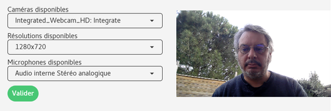

+++
title = "F.A.Q."
template = "section.html"
+++



Plusieurs conditions sur le nom d'utilisateur doivent être respectées : il ne
doit contenir que des lettres (minuscules ou majuscules), des chiffres, des
traits d'union (<code>-</code>) ou <em>underscore</em> (<code>_</code>).

En particulier, les accents, les espaces, et autres caracètres spéciaux sont interdits.





L'e-mail de validation peut mettre quelques minutes à arriver. Si vous ne
l'avez pas reçu au bout de quelques minutes, peut-être y a-t-il eu une erreur
de saisie de votre adresse e-mail ? Dans ce cas, vous pouvez essayer de vous
réinscrire avec un nom d'utilisateur différent mais avec la même adresse
e-mail, ou essayer avec une adresse e-mail différente.





Ce problème vient souvent du fait que votre compte est déjà activé. Vous pouvez
essayer de vous connecter normalement via <a href="/">le formulaire de connexion</a>.





Cette erreur vient du fait que Polymny n'est pas parvenu à accéder à votre
webcam. Cela peut-être du à plusieurs causes :

  - votre ordinateur n'a pas de webcam ou aucune webcam n'est branchée
  - votre webcam est déjà utilisée par un autre logiciel

Pour résoudre ce problème, assurez-vous que votre webcam est bien branchée et
fonctionne correctement, et fermez les autres logiciels susceptibles d'utiliser
la webcam.

Si cela ne fonctionne pas, vous pouvez essayer de redémarrer votre ordinateur,
ou d'utiliser un autre navigateur web.





Vous pouvez choisir votre caméra ou votre micro en cliquant sur le bouton
"paramètres" de la vue Filmer.

Vous avez le choix entre utiliser la caméra et le micro ou bien le micro
seul. Le micro seul permet de faire des enregistrements plus léger, notament
dans le cas de connexion internet à faible débit.





Nous recommandons <a href="https://www.mozilla.org/firefox/new/">Mozilla
Firefox</a>. C'est le navigateur sur lequel nous avons fait le plus de tests.

Nous testons aussi <a href="https://www.google.com/chrome/">Google Chrome</a> /
<a href="https://www.chromium.org/">Chromium</a>.

Il est possible que Polymny fonctionne aussi sur d'autres navigateurs, mais ils
ne sont pas testés et vous pouvez rencontrer des erreurs.



