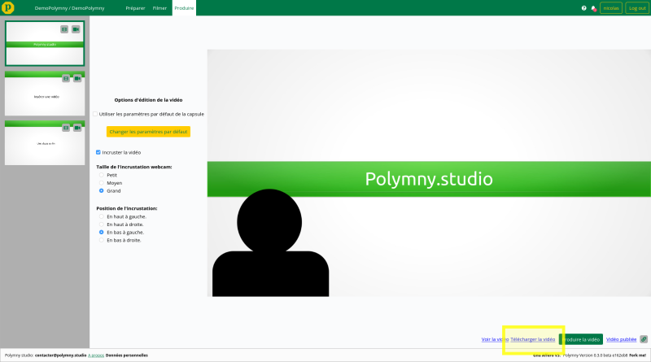
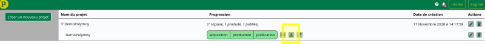
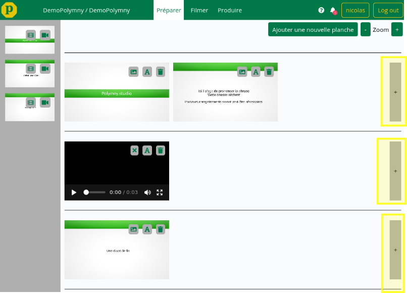

+++
title = "Nouveautés de la v0.3.1"
template = "section.html"
+++

## Ajout de boutons pour télécharger la vidéo réalisée

Il est maintenant possible de téléchargée la capsule vidéo réalisée au format mp4.

Depuis la vue produire,

ou bien directement sur la page d'acceuil,

## Ajout d'un lien vers les tutoriels

Les tutoriels et aides de polymny sont directement consultable à partir de l'espace de travail.

## Ajout d'une nouvelle planche

Il est possible de rajouter une nouvelle planche (au format PDF ou image) dans chaque groupe de planche.

## Corrections de bugs
  -  Ajout d'une indication "Téléchargement et transcodage en cours" lorsqu'on
     ajoute une vidéo supplémentaire. Rajouter une vidéo peut être un peu long
     car il faut la copier vers le serveur puis la transcoder.
  -  Demande de confirmation lorsque l'on supprime une planche
  -  Lorsque l'on supprime une planche, suppression de l'enregistrement lié à
     cette planche
  -  Ajout d'une vérification de la validité de l'email lors de la création de
     compte
  -  Ajout d'un lien vers l'usage des données personnelles.

