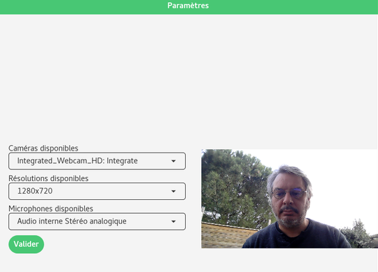

+++
title = "Nouveautés de la v0.4.0"
template = "news.html"
date = 2021-02-12
+++

## Sélection de la webcam et du micro

Dorénavant, il est possible de choisir le micro ou la webcam que l'on souhaite
utiliser. On peut aussi utiliser le micro seul afin d'enregistrer uniquement
l'audio.

Ces réglages ce font dans la vue "Filmer" à travers le bouton "Paramètres".

## Welcome HLS

Les utilisateurs d'iPhone et Safari peuvent, dorénavant, visionner les vidéos publiées.

Il est néanmoins regrettable qu'Apple refuse de supporter le streaming adaptatif en DASH.

{{ polymny(id="757685ed-56d0-44b5-9fff-777f8a9e0909") }}

## Interface graphique remaniée

Le design de Polymny a été retouchée afin d'avoir un rendu plus cohérent entre les vues.

## Corrections de bugs
  -  Correction de décalage entre l'audio et la vidéo. Les vidéos en 30 fps
     cohabitaient mal avec celles à 25. Maintenant, elles sont alignées.
  -  Correction de bug sur l'enregistrement avec webcam ayant un nombre
     d'images par secondes faible.
  -  Correction sur les noms de fichiers contenant des apostrophes.

